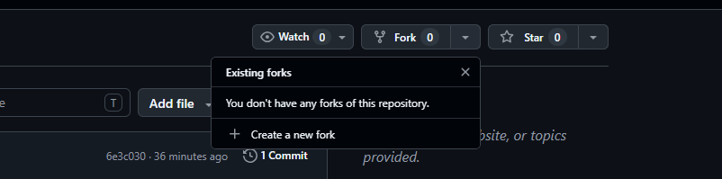
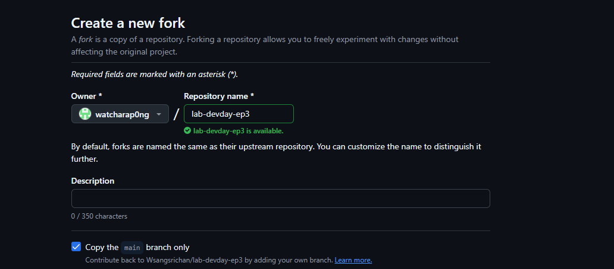
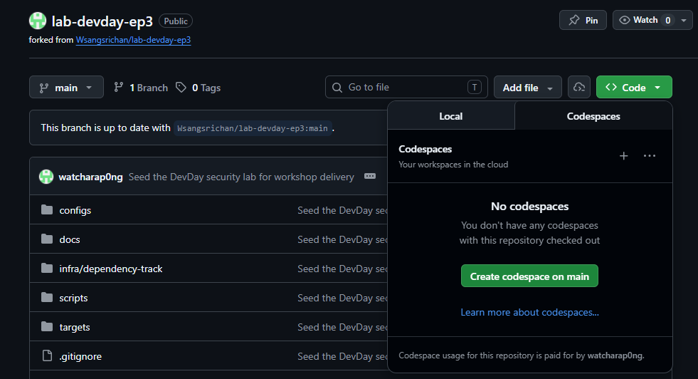

## เครื่องที่จะใช้ทำเวิร์กช็อป
ใช้ GitHub Codespaces

1. ถ้ายังไม่มี GitHub ให้สมัคร (ต้องใช้บัญชี CMU เท่านั้นในฟอร์มนี้) => [ลงทะเบียนใช้งาน GitHub Enterprise for CMU](https://forms.office.com/pages/responsepage.aspx?id=3_GBz1neKUyR2qLf0EqnUfWFICr-s69FptDpdUKDz5hUMUE2UUVFTTlNMDQwVU9LTFc0VlAzTE80MC4u&route=shorturl)

2. Fork repo จาก GitHub

3. เลือก Owner

4. สร้าง Codespace

